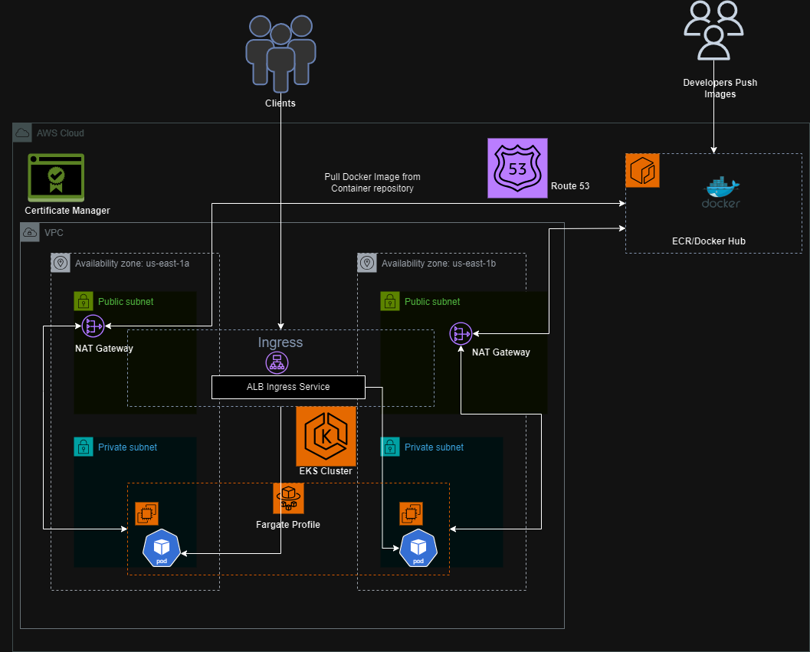

# EKS Fargate Cluster with AWS CDK (Golang), Flask App, and Kustomize

This project sets up an EKS Fargate cluster on AWS, deploys a simple Flask web application, and manages Kubernetes resources using Kustomize. The infrastructure is defined using AWS CDK, and CI/CD is managed with GitHub Actions.

## Project Structure
├── app  
│ ├── app.py  
│ ├── Dockerfile     
│ ├── Docker-compose.yaml  
│ ├── Makefile  
│ ├── requirement.txt  
├── cdk  
│ ├── utils 
│ │ └── logs.go  
│ ├── cdk.go  
│ ├── go.mod  
│ ├── go.sum  
│ └── cdk.json  
│ └── cdkpolicy.json  
├── k8s-manifest  
│ ├── base  
│ │ ├── deployment.yaml  
│ │ ├── service.yaml  
│ │ ├── ingress.yaml  
│ │ ├── kustomization.yaml  
│ ├── overlays  
│ │ ├── dev  
│ │ │ └── kustomization.yaml  
│ │ ├── prod  
│ │ │ └── kustomization.yaml  
│ │ | └── deployment-prod.yaml  
├── .github  
│ └── workflows  
│ └── ci-cd.yml  
└── README.md  


## Installation Instructions

1. **Clone the repository**:
    ```sh
    git clone https://github.com/lordwales/eks-cdk.git
    cd eks-cdk
    ```

2. **Install dependencies**:

    - **AWS CLI**:
      ```sh
      sudo apt-get update
      sudo apt-get install -y python3-pip
      pip3 install awscli
      ```

    - **AWS CDK**:
      ```sh
      npm install -g aws-cdk
      ```

    - **Go**:
      ```sh
      wget https://golang.org/dl/go1.18.linux-amd64.tar.gz
      sudo tar -C /usr/local -xzf go1.18.linux-amd64.tar.gz
      export PATH=$PATH:/usr/local/go/bin
      ```

    - **kubectl**:
      ```sh
      curl -LO "https://storage.googleapis.com/kubernetes-release/release/$(curl -s https://storage.googleapis.com/kubernetes-release/release/stable.txt)/bin/linux/amd64/kubectl"
      chmod +x ./kubectl
      sudo mv ./kubectl /usr/local/bin/kubectl
      ```

    - **Kustomize**:
      ```sh
      curl -s "https://raw.githubusercontent.com/kubernetes-sigs/kustomize/master/hack/install_kustomize.sh"  | bash
      sudo mv ./kustomize /usr/local/bin/
      ```

## Usage

1. **Set up AWS credentials**:
    ```sh
    aws configure
    ```

2. **Bootstrap CDK**:
    ```sh
    cdk bootstrap aws://<AWS ACCOUND ID>/<REGION> --cloudformation-execution-policies "arn:aws:iam::<AWS ACCOUND ID>:policy/cdkCFExecutionPolicy"
    #check cdk/cdkpolicy.json  for the policy context (This is to follow the principle of Least privilege)

    ```

3. **Deploy CDK stack**:
    ```sh
    cd cdk
    cdk deploy 
    ```

4. **Update kubeconfig**:
    ```sh
    aws eks update-kubeconfig --name MaxCluster
    ```

5. **Deploy Kubernetes resources using Kustomize**:
    ```sh
    kubectl apply -k k8s-manifest/overlays/prod
    ```

## Why Kustomize?

Kustomize allows us to customize Kubernetes resource definitions without modifying the original files. It simplifies management of different environments by providing a clean and effective way to apply environment-specific configurations.

**Benefits of Kustomize**:
- No need to modify the original files.
- Reusability of original configurations.
- Easy to apply different configurations for different environments (e.g., dev, prod).

## CI/CD Workflow

The CI/CD pipeline is configured using GitHub Actions and is located in `.github/workflows/ci-cd.yml`. It includes the following steps:

- Checkout the repository
- Install dependencies (AWS CLI, CDK, Go, kubectl, Kustomize)
- Configure AWS credentials
- Deploy CDK stack
- Update kubeconfig
- Apply Kustomize overlays

The workflow is configured to deploy when there is a push to the `main` branch.

## Future Improvements

1. **Environment-specific Resource Names**:
    - Adjust the CDK resource creation to append the environment name to resource names for better separation and management.
  
2. **Deployment To Different Environment**:
   - The current immplementation takes care of just one environment. In a more relaible state, we would want to create deployment to Dev, Staging and Prod. The workflow will need to be updated accordingly. This will also allow us to have seperate secrets for the different environments.

3. **Deployment Authorization**:
    - Modify the CI/CD workflow to require manual approval before deploying to the prod environment. This can be done using GitHub Actions' `workflow_dispatch` event and `environment` protection rules.

Example adjustment for manual approval:

```yaml
jobs:
  deploy:
    runs-on: ubuntu-latest

    strategy:
      matrix:
        environment: [dev, prod]

    environment:
      name: ${{ matrix.environment }}
      url: ${{ secrets.ENVIRONMENT_URL }}

    steps:
    - name: Checkout repository
      uses: actions/checkout@v2

    ...

    - name: Deploy to prod with manual approval
      if: github.ref == 'refs/heads/main' && matrix.environment == 'prod'
      environment:
        name: prod
        url: ${{ secrets.ENVIRONMENT_URL }}
      run: cdk deploy --all --require-approval broad
```


## Assumptions Made
- AWS credentials are correctly set up and configured.
- Necessary permissions are granted for creating and managing AWS resources.
  ```json
  aws iam create-policy \
    --policy-name cdkCFExecutionPolicy \
    --policy-document file://cdkpolicy.json

  ```
- The GitHub repository has secrets configured for AWS access.
- The base Kustomize files are correctly defined and overlay files are appropriately customized for different environments.

## Architectural Diagram


